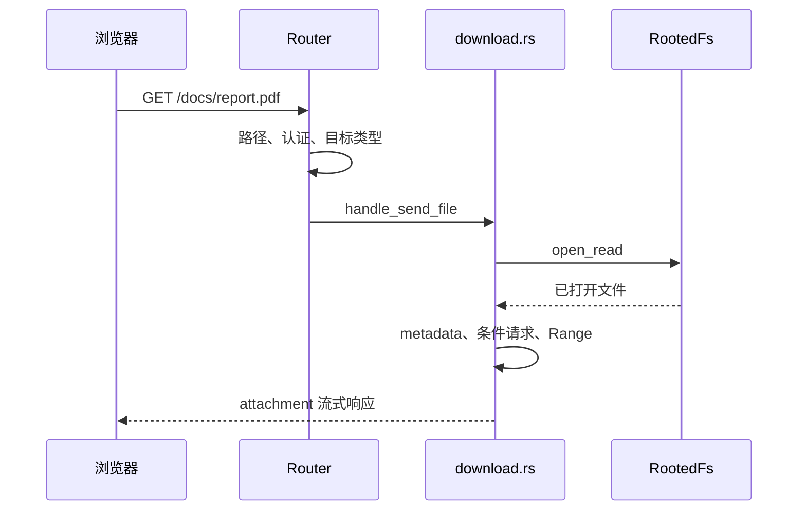
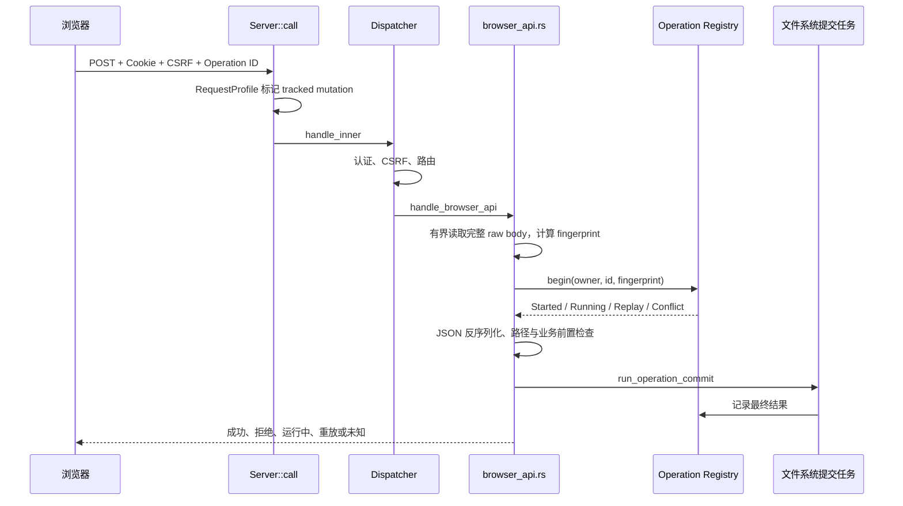

# 04. 后端请求完整旅程：从端口到响应

上一章介绍了阅读本项目所需的 Rust 和 Web 基础。本章把这些概念放进一条真实调用链：Dufs 如何启动，如何接受 TCP 连接，如何判断请求是否需要登录和 CSRF，最后又如何把请求交给列表、下载或写操作模块。

这一章聚焦 HTTP 层和任务生命周期。路径如何抵抗符号链接逃逸、SQLite 如何记录状态、删除为何需要持久化清理任务，将在[第 5 章](05-filesystem-state-and-reliability.md)展开；上传状态机则留到[第 7 章](07-upload-protocol.md)。

## 4.1 先建立一张总图

可以先把一次请求记成下面九站：


代码入口主要分布在：

| 阶段 | 关键源码 | 负责什么 |
| --- | --- | --- |
| 进程入口 | [src/main.rs](../../src/main.rs) | 参数、信号、listener、连接和停机 |
| 参数校验 | [src/args.rs](../../src/args.rs) | 把外部配置转换成可信配置 |
| 服务组装 | [src/server.rs](../../src/server.rs) | `ServerBuilder`、依赖分组和后台任务 |
| Router 外层 | [src/server/router.rs](../../src/server/router.rs) | 请求分类、总超时、日志、错误与缓存 |
| 请求画像 | [src/server/router/request.rs](../../src/server/router/request.rs) | `RequestProfile` 和 `MutationProgress` |
| 分阶段路由 | [src/server/router/dispatch.rs](../../src/server/router/dispatch.rs) | 公共路由、认证、CSRF、API、内容路由 |
| 会话 | [src/server/session.rs](../../src/server/session.rs) | 登录、Cookie、来源校验和 CSRF |
| 浏览器写 API | [src/server/browser_api.rs](../../src/server/browser_api.rs) | 新建、移动、重命名和上传预检 |
| 列表与下载 | [src/server/listing.rs](../../src/server/listing.rs)、[download.rs](../../src/server/download.rs) | 目录页面、列表 JSON 和文件流 |

初次阅读时不要试图同时理解全部实现。先追踪函数之间“把什么事实交给下一层”，再研究每个文件内部如何保证安全。

## 4.2 第一步：`main` 把进程启动起来

程序入口是 [main.rs](../../src/main.rs) 中带有 `#[tokio::main]` 的异步 `main`。这个属性会创建 Tokio 运行时，然后在其中执行异步入口函数。

启动过程依次是：

1. `build_cli()` 建立 Clap 命令行定义；
2. 如果用户执行 `hash-password`，读取两次密码、生成哈希并退出；
3. `Args::parse(matches)` 合并 CLI/YAML，并完成第一轮校验与路径规范化；
4. 初始化日志；
5. 安装 SIGINT 和 SIGTERM 信号监听；
6. 调用 `serve(args)` 构建服务并创建 listener；
7. 打印实际监听地址；
8. 等待停止信号，或等待所有 listener 意外退出；
9. 进入优雅停机。

这里有一个重要分层：`Args::parse()` 本身已经调用 `Args::validate()`，所以命令行启动在初始化日志和监听端口前就会拒绝无效账号、并发数、超时、共享根或状态目录；但 `Args` 是公开、字段可修改的库接口，调用方也可以不经 CLI 直接构造它。`ServerBuilder` 因此还会通过 [args.rs](../../src/args.rs) 的 `ValidatedConfig::try_from(args)` 重新校验，把后端内部真正依赖的边界封装成私有内部值。

可以把这两个类型理解成：

```text
Args::parse()    = CLI/YAML 合并后已校验，但仍是公开可变的 Args
ValidatedConfig  = Server 构建时重新校验并封装的内部只读边界
```

若校验失败，程序在监听端口前退出。这比服务启动后才在某个请求中发现目录或账号配置无效更容易排错，也更安全。

## 4.3 `ServerBuilder` 组装长期服务

`serve(args)` 不会直接写出一个巨大的 `Server { ... }`，而是调用：

```rust
let runtime = Server::builder(args).build()?;
```

相关实现位于 [server.rs](../../src/server.rs)：

- `ServerBuilder` 保存构建参数；
- `ServerBuilder::build` 检查当前确实位于 Tokio runtime 中；
- `Server::init_with_list_snapshot_cache` 完成依赖初始化；
- 构建后的 `Server` 被放入 `Arc`；
- `start_maintenance` 启动后台维护任务；
- 最终返回 `ServerRuntime`。

### 为什么 `ServerRuntime` 内还持有 `Arc<Server>`

`ServerBuilder::build()` 实际只返回 `ServerRuntime`；`serve()` 再通过 `runtime.server().clone()` 取得其中的 `Arc<Server>` 句柄。listener、连接和后台任务可以廉价地克隆这个句柄。克隆 `Arc` 只增加引用计数，不会复制数据库、缓存或整个服务器。

`ServerRuntime` 则拥有生命周期控制权，包括：

- 何时停止接收新工作；
- 如何等待普通后台任务；
- 如何等待已经分离的持久写操作；
- 何时关闭状态存储线程。

如果只保存 `Arc<Server>` 而没有一个负责收尾的 runtime，就很难定义“程序什么时候才算安全退出”。

### Server 内部不是一排无关字段

当前 `Server` 把依赖分成四组：

| 分组 | 直观含义 | 代表成员 |
| --- | --- | --- |
| `ContentServices` | 请求内容和文件访问所需服务 | 配置、认证、路径策略、列表缓存、`RootedFs` |
| `DurableStateServices` | 能跨请求或重启保留的控制状态 | Operation Registry、StateStore、上传记录、清理队列 |
| `AdmissionControl` | 限制并发和资源使用 | 登录、上传、写操作、搜索信号量，磁盘空间追踪 |
| `ServerLifecycle` | 谁能继续工作以及如何停机 | cancellation token、`TaskTracker`、request gate |

这四组仍由 `Server` 统一组合，但每一组的职责更容易审查。Rust 还允许在不同文件中写多个 `impl Server`，所以 `listing.rs`、`download.rs` 和 `browser_api.rs` 中的方法仍属于同一个 `Server`，不是继承出来的子类。

### 构建时还启动了什么

`start_maintenance` 会登记三类后台工作：

1. 删除内容的 purge worker；
2. 恢复未完成删除准备记录的 reconciler；
3. 上传会话和内部暂存文件的 maintenance。

这些任务进入 `work_tasks` 追踪器，停机时不会被悄悄遗忘。它们为何存在会在[第 5 章](05-filesystem-state-and-reliability.md)和[第 7 章](07-upload-protocol.md)解释。

## 4.4 从 listener 到一个 Hyper 请求

`serve` 会为每个配置的 IP 创建一个 TCP listener。所有 listener 共用：

- 同一个 `Arc<Server>`；
- 同一组关闭 token；
- 同一个连接 `TaskTracker`；
- 同一个最大连接数信号量。

这意味着配置多个监听地址不会让每个地址分别获得一整份连接额度。`max-connections` 是进程级总额度。

### 接受连接

`serve_tcp_listener` 循环执行 `listener.accept()`。如果 accept 暂时失败，不会无间隔疯狂重试，而是从 50ms 开始指数退避，最高约 1 秒；一次成功后退避重置。

接受一个 socket 后，代码先等待全局连接许可，再把连接登记进 `connection_tasks`。许可由 RAII guard 持有：连接任务结束时 guard 被丢弃，额度自动归还。

### 把 TCP 交给 Hyper

`handle_stream` 使用 Hyper HTTP/1 builder 建立连接处理器。当前边界包括：

- 请求头读取超时 10 秒；
- HTTP 缓冲区最大 64 KiB；
- 响应写入连续 30 秒没有进展时中止该连接；
- 停机时先调用 Hyper 的 graceful shutdown，停止 keep-alive 接收后续请求。

需要区分三种时限：

| 时限 | 保护什么 | 到期意味着什么 |
| --- | --- | --- |
| 请求头读取超时 | 慢速或不完整 HTTP 请求头 | 当前连接协议处理失败 |
| 普通请求总超时 | 一次业务处理占用太久 | Router 生成超时响应；写操作需再看提交阶段 |
| 响应写空闲超时 | 客户端长期不读取响应 | socket 写失败，不能反推业务操作未执行 |

Hyper 的 `service_fn` 最终执行：

```text
Arc<Server>::clone()
    → Server::call(request, peer_addr)
```

同一条 HTTP/1 keep-alive 连接可以先后承载多个请求；每个请求都会重新进入 `Server::call`，不会绕过认证和路由。

## 4.5 `Server::call`：统一的 HTTP 边界

[router.rs](../../src/server/router.rs) 中的 `Server::call` 是所有请求的统一入口。它不直接实现下载或重命名，而是负责那些必须对所有路由保持一致的规则。

主要步骤如下：

1. 把 URI path 解析成受约束的 `RoutePath`；
2. 判断它是否为编译时嵌入的公开哈希资产；
3. 创建 `RequestProfile`；
4. 进入生命周期的 request gate；
5. 创建访问日志 `RequestContext`；
6. 调用 `handle_inner` 和 `RequestDispatcher`；
7. 对非上传请求应用统一总超时；
8. 把内部错误转换成合适的 HTTP 响应；
9. 填充 Operation 头和访问日志字段；
10. 应用缓存策略并返回响应。

如果 URL 无法被安全解析，`handle_inner` 会返回 `400 Invalid Path`，而不是把原始 URL 字符串直接交给磁盘 API。路径类型的细节见[第 5 章](05-filesystem-state-and-reliability.md)。

### request gate 是停机闸门

每个进入路由的请求都持有 `request_gate` 的读锁。正常运行时很多请求可以同时持有读锁。停机阶段，`ServerRuntime::shutdown` 申请写锁：

```text
正常运行：请求 A 读锁 + 请求 B 读锁 + 请求 C 读锁
停机收束：等待全部读锁离开 → 获得唯一写锁 → 不再允许晚到任务登记
```

进入锁后还会再次检查 shutdown token。这样即使某处长期保存了 `Arc<Server>`，也不能在 runtime 已关闭后偷偷启动新的文件系统义务。

若服务器正在停止，Router 会按请求种类返回不同的 `503`：

- 有 Operation ID：`rejected`，建议稍后重试；
- 有完整上传上下文：`not-started`；
- 内部 API：结构化 problem JSON；
- 普通内容请求：简单错误响应。

## 4.6 `RequestProfile`：先分类一次，后面统一使用

[router/request.rs](../../src/server/router/request.rs) 中的 `RequestProfile` 不处理业务，而是从方法、路径和关键头中提取请求画像：

| 字段 | 用途 |
| --- | --- |
| `public_asset` | 是否为登录页可访问的内容寻址静态资产 |
| `omit_success_log` | 成功读取静态资产时是否省略重复访问日志 |
| `upload` | 是否为 PUT 或 PATCH 上传 |
| `internal_api` | 是否应使用内部 API 的认证、错误和超时语义 |
| `upload_context` | 是否能从请求头提取上传 ID、长度和偏移 |
| `operation_id` | 是否能提取被追踪写操作的 Operation ID |
| `mutation` | 普通操作是否已分离提交，以及上传首次 mutation 是否已越界或已被 deadline 关闭 |

为什么不让认证、超时、日志和错误处理各自重新判断“这是不是 API”？因为规则会逐渐漂移。例如一个新路由可能在认证分支被当成 API，却在超时分支被当成普通页面。集中画像让所有横切逻辑共享同一事实。

`RequestProfile` 只是 HTTP 边界画像，不代表请求已经验证成功。比如它可能提前看见一个上传头，但严格的格式校验仍由 Dispatcher 和上传协议代码完成。

## 4.7 `RequestDispatcher`：固定顺序的五个阶段

[router/dispatch.rs](../../src/server/router/dispatch.rs) 中的 `RequestDispatcher` 拥有这次请求在路由期间需要的事实：

- `Arc<Server>`；
- 原始 `Request`；
- 已解析的 `RoutePath`；
- method、URI、headers 和 query 参数；
- `MutationProgress`；
- 访问日志上下文；
- 正在构造的 `Response`。

原始请求存成 `Option<Request>`，是因为请求 body 只能被一个业务分支消费。`take_request()` 取走后，再次取用会暴露编程错误。这是 Rust 所有权在真实项目里的一个直接用途。

`dispatch` 严格按以下顺序执行：

```text
公共路由
   ↓ 未命中
认证
   ↓ 成功
CSRF
   ↓ 通过或不需要
已登录内部 API
   ↓ 未命中
共享目录内容路由
```

每个阶段返回 `Phase::Continue` 或 `Phase::Complete`。一旦某阶段已经生成完整响应，后续阶段不会继续执行。例如登录页不应再被当成共享根里的 `__dufs__/login` 文件。

## 4.8 阶段一：无需登录的公共路由

公共路由有三类。

### liveness

`GET` 或 `HEAD /__dufs__/health` 返回简短 JSON，只说明进程仍能接受 HTTP 请求。它不读取账号、共享目录或状态库细节，因此可以开放给进程监督器。

其他方法会返回 `405 Method Not Allowed`。

### 登录

- `GET /__dufs__/login` 返回嵌入二进制的登录 HTML；
- `POST /__dufs__/login` 读取表单、验证密码、创建会话并 `303` 跳转到 `/`。

登录处理本身也有保护：

- 显式 `Sec-Fetch-Site: cross-site` 会被拒绝；若带 `Origin`，其外部 scheme/authority 必须与请求匹配；没有 `Origin` 的兼容客户端不会仅因此被拒绝；
- 只接受 `application/x-www-form-urlencoded`；
- 正文上限 4 KiB；
- 正文读取超时 10 秒；
- 有全局和单 IP 正文接纳上限；
- 有登录速率限制和账号退避；
- 密码哈希验证放入阻塞任务，并限制并发数量。

这些限制不是普通业务 Router 总超时的替代品，而是登录这个高成本入口自己的更窄边界。

### 内容寻址静态资产

登录页面需要 CSS 等资源，因此带版本摘要前缀的嵌入资产也允许匿名 GET/HEAD。前缀绑定注册资源的名称、MIME 类型和内容，只有成功返回的这类资产可以长期缓存。

普通目录页面、列表 API 和 readiness 都不属于公共路由。

登录 POST 是公共路由阶段的特殊写请求：它发生在会话认证和全局 CSRF 阶段之前，因此没有“已登录会话 + CSRF header”；它依靠上述来源判断、严格表单、登录限流以及成功后创建的新会话。不要把后文“已认证 POST 都要 CSRF”错误套到登录表单上。

## 4.9 阶段二：验证会话 Cookie

登录成功后，服务端设置名为 `__Host-dufs-session` 的 Cookie。它具有：

- `Path=/`；
- `HttpOnly`，页面 JavaScript 不能直接读取；
- `Secure`，浏览器只在安全上下文发送；
- `SameSite=Strict`，降低跨站携带风险。

Dispatcher 从请求的 `Cookie` 头提取 token，再交给认证存储查找会话。认证成功后，把用户名写入访问日志上下文，并把会话信息交给后续路由。

未登录响应取决于请求意图：

- 浏览器访问普通 GET/HEAD 且明确接受 HTML：`303` 跳转登录页；
- 内部 API：`401 application/problem+json`；
- 其他内容请求：普通 `401`。

这种差别是有意的。页面导航适合重定向；`fetch` 调用更需要明确的机器可解析错误，避免把登录页 HTML 误当成 JSON。

readiness 是一个容易混淆的例外：它在认证成功后由 API 分发阶段处理，但 `RequestProfile.internal_api` 有意不包含它。因此未认证 `/__dufs__/ready` 会沿普通内容响应语义，根据 `Accept` 得到普通 `401` 或登录 `303`，不保证返回 Problem Details；停机、普通总超时和未处理错误同样不套内部 API 的 JSON 外壳。

## 4.10 阶段三：对写请求执行 CSRF 校验

仅有 Cookie 不足以证明写请求来自本页面。浏览器可能在其他网站的诱导下向当前站点发送带 Cookie 的请求，所以通过公共路由并已完成认证、继续到此阶段的以下方法还必须通过 CSRF：

- POST；
- PUT；
- PATCH；
- DELETE。

校验同时要求：

1. 来源检查没有发现显式 cross-site，且存在 `Origin` 时其外部 scheme/authority 匹配；
2. `X-Dufs-CSRF-Token` 与当前 session 绑定的 token 匹配。

同源检查会考虑 `Origin`、`Host`、`Sec-Fetch-Site`。只有连接来自 loopback 网关时，才信任规范的单值 `X-Forwarded-Proto` 等代理信息。这与推荐的“浏览器 HTTPS → nginx → 回环 HTTP Dufs”拓扑相配合。

GET 和 HEAD 不走 CSRF，但仍需登录，除非它们属于前一节的公共路由。公共登录 POST 也已在到达此阶段前完成。CSRF 失败时，内部 API 返回带稳定错误代码的 problem JSON；普通内容路由返回拒绝响应。

不要用“请求有自定义头，所以一定安全”来理解 CSRF。真正的保证来自同源判断、会话绑定 token 和安全 Cookie 属性共同作用。

## 4.11 阶段四：已登录内部 API

认证和必要的 CSRF 均通过后，Dispatcher 依次识别：

| 路由 | 方法 | 作用 |
| --- | --- | --- |
| `/__dufs__/logout` | POST | 销毁当前会话并清 Cookie |
| `/__dufs__/ready` | GET、HEAD | 实际探测共享根、空间、状态存储和生命周期 |
| `/__dufs__/api/jobs/<uuid>` | GET | 查询一次被追踪写操作的状态 |
| `/__dufs__/api/list` | GET | 返回分页目录或搜索 JSON |
| `/__dufs__/api/mkdir` | POST | 新建目录 |
| `/__dufs__/api/move` | POST | 把项目移入另一个目录 |
| `/__dufs__/api/rename` | POST | 在原父目录修改名称 |
| `/__dufs__/api/upload/preflight` | POST | 上传前批量观察目标是否冲突 |
| `/__dufs__/api/upload/discard` | POST | 先将等待覆盖确认的上传持久化为 Rejected，再按 identity 条件清理 stage；Rejected 可幂等重试 |

不存在的 browser API 返回类型化 `404`，已知 API 使用错误方法则返回 `405` 并带 `Allow` 信息。这样“路由不存在”和“路由存在但方法写错”不会混成同一种故障。

这里的“内部 API 阶段”是 Dispatcher 的执行顺序，不等同于上一节 `RequestProfile.internal_api` 的外层响应分类；readiness 正是在该阶段处理、但不带 `internal_api` 分类的例外。

mkdir、move、rename 是带 Operation ID 的被追踪操作；upload preflight 和 discard 属于上传协议，不使用同一套普通 Operation 登记。DELETE 虽然也是被追踪写操作，但它的 URL 就是被删除内容的路径，因此在下一阶段处理。

## 4.12 阶段五：共享目录内容路由

没被内部 API 消费的已登录请求，会被解释为共享根中的内容目标。这个阶段先做准备，再根据 HTTP 方法分发。

准备工作包括：

1. DELETE 必须解析 `X-Dufs-Operation-Id`；
2. PUT/PATCH 必须解析上传 ID、长度、偏移和覆盖策略；
3. 拒绝用户直接操作内部保留命名空间；
4. 将 `RoutePath` 转换成共享根下的目标路径；
5. 禁止删除共享根本身；
6. 必要时取得路径租约和上传并发许可；
7. 读取目标 metadata，并隐藏逃出根目录或内部保留目标；
8. HEAD 带上传 ID 时优先进入上传状态查询；
9. 最后按方法分发。

方法分派为：

```text
GET / HEAD → 目录页面、搜索结果或单文件下载
PUT        → 新上传
PATCH      → 续传或重新尝试发布完整 stage
DELETE     → 被追踪删除
其他方法    → 405
```

注意，路径“看起来不存在”不一定就是公开的普通 404。它也可能因为越出共享根或命中隐藏内部项而被故意表现成 404，以免泄露内部结构。

## 4.13 目录页面和列表 API 是两次请求

用户在地址栏打开 `/photos/` 时，通常先经过内容路由：

```text
GET /photos/
→ dispatch_content_read
→ handle_ls_dir
→ 返回嵌入的 HTML 页面骨架和少量初始上下文
```

页面 JavaScript 启动后，再请求：

```text
GET /__dufs__/api/list?path=/photos&sort=name&order=asc&limit=200
→ dispatch_authenticated_api
→ handle_list_api
→ 返回 JSON 项目和下一页 cursor
```

因此“页面能打开但列表加载失败”完全可能发生：第一条请求成功，第二条 API 请求失败。调试时要在浏览器 Network 面板分别查看 document 和 list fetch，不能只看地址栏状态。

列表 API 负责分页、排序、搜索和短期快照。默认页大小为 200，单页最多 500。快照与用户、路径和查询条件绑定，目录发生变化时会要求刷新。具体并发与路径身份保证放在[第 5 章](05-filesystem-state-and-reliability.md)。

## 4.14 单文件下载链路

下载入口位于 [download.rs](../../src/server/download.rs)：



下载模块不会先把整个文件读进内存。它以约 64 KiB 的块流式输出，并把流限制在打开文件时记录的长度，避免其他进程追加同一 inode 后当前响应无限增长。

它还处理：

- `Content-Disposition: attachment`；
- 根据扩展名推测的 `Content-Type`；
- ETag 和 Last-Modified；
- `If-Match`、`If-None-Match` 等条件请求；
- 单个字节 Range；
- HEAD 只返回头、不返回正文。

当前只支持单文件下载。目录请求携带任何 `zip` 查询参数都会返回明确的 `410 Gone` problem，不会退回一个看似成功的 HTML 页面。

## 4.15 浏览器写操作链路

以重命名为例，前端发送：

```http
POST /__dufs__/api/rename
Cookie: __Host-dufs-session=...
X-Dufs-CSRF-Token: ...
X-Dufs-Operation-Id: 规范 UUID
Content-Type: application/json

{"source":"/docs/old.txt","name":"new.txt","overwrite":false}
```

后端链路是：



Operation ID 让客户端可以安全识别“同一个意图”：

- 同一用户、同一 ID、同一请求仍在运行：返回 running；
- 同一用户、同一 ID、同一请求已完成：重放保存结果；
- 同一用户、同一 ID、不同请求：返回冲突；
- 从未登记的 ID：可以作为新操作开始。

移动和重命名是两个公开 API，但会共享安全的 relocation 提交实现。移动只改变父目录并保留原名称；重命名只改变 basename 并保留原父目录。共享底层实现可以避免两套并发检查逐渐不一致。

DELETE 使用同样的 Operation 语义，但入口是 `DELETE /实际路径`。删除会先让项目从用户可见命名空间消失，再由后台清理；这里只需知道其 HTTP 请求也可能在客户端离开后继续，持久化细节见[第 5 章](05-filesystem-state-and-reliability.md)。

PUT/PATCH 上传有自己的 Upload ID、阶段和超时，不应与普通 Operation ID 混为一谈，详见[第 7 章](07-upload-protocol.md)。

## 4.16 `MutationProgress`：超时时如何避免撒谎

普通请求由 `Server::call` 应用配置中的 `request-timeout`，默认 300 秒。上传被排除在这个外层总超时之外，因为上传拥有自己的总时限和空闲时限。

对只读请求，超时通常可以直接回答“本次 HTTP 请求超时”。对重命名或删除则没这么简单：客户端停止等待时，文件系统提交任务可能已经独立运行。

普通 Operation 路径使用 `MutationProgress` 的三个主要阶段：

```text
PREFLIGHT
    │ Operation Registry 已接受 ID
    ▼
RESERVED
    │ commit task 已登记，可脱离 HTTP waiter 继续
    ▼
DETACHED_COMMIT
```

### `PREFLIGHT`

请求可能还在认证、校验请求头或 Content-Type，或为被追踪的 browser mutation 有界收集 raw body；Operation Registry 尚未接受该 ID。JSON 反序列化、路径和业务前置检查发生在登记之后，属于下面的 `RESERVED` 阶段。此时没有一个独立提交任务会在 HTTP waiter 消失后继续。

### `RESERVED`

Operation ID 已经被 Registry 接受，但提交尚未分离。仅仅登记了 ID，不代表磁盘已经修改，也不代表结果必须报告 unknown。

### `DETACHED_COMMIT`

`run_operation_commit` 已取得写操作并发许可，并把任务登记到 `commit_tasks`。即使外层 HTTP future 因超时被丢弃，这个任务仍可能继续执行。

这里的 `DETACHED_COMMIT` 是“任务所有权边界”，不一定等于磁盘上的 `rename` 已经发生。Router 采用保守语义：只要任务能够比 HTTP waiter 活得更久，就不能再承诺“操作没有发生”。

超时响应因此分成两类：

| 超时时阶段 | Operation 状态 | 对客户端的建议 |
| --- | --- | --- |
| `PREFLIGHT` 或 `RESERVED` | `rejected` | 使用同一 Operation ID 重试是安全的 |
| `DETACHED_COMMIT` | `unknown` | 先查询 job 状态，不能直接重做 |

这解决了一个常见错误：把所有超时都解释成失败，然后用户再次点击，导致原操作和重试同时生效。

### 上传为什么不能只看“task 已经 spawn”

上传也在 `commit_tasks` 中受跟踪，但它可能先做较慢的只读准备：查询 owner-scoped 会话、目标 identity/metadata、stage identity 和空间信息。`53f15ee` 之后，上传 task 的登记不再自动把结果推进为 unknown；它在首次创建祖先/stage、截断 stage、更新上传状态或接收正文前才执行原子比较交换：

```text
                     task 先赢
PREFLIGHT ─────────────────────────> DETACHED_COMMIT / 可以 mutation
    │
    │ total deadline 先赢
    ▼
CANCELLED_BEFORE_UPLOAD_MUTATION ──> abort task / 永远不能再越界
```

因此服务端总 deadline 与首次 mutation 只有一个能赢：

| 结果 | HTTP/上传状态 | 恢复动作 |
| --- | --- | --- |
| deadline 先关闭边界 | `408 request_timeout + not-started` | `retry`，但先用原 Upload ID 做 HEAD |
| 只读准备的 timeout 逸出 | `408 request_timeout + not-started` | 同上 |
| 只读准备的其他未处理 I/O 逸出 | `503 upload_precommit_failed + not-started` | 同上 |
| task 已跨 mutation boundary 后，外层 deadline 或未处理错误逸出 | `unknown` | `query_upload`，禁止盲目重放 |

关闭边界后再 `abort` 不是依赖“希望任务来得及取消”：即使较慢的只读系统调用稍后返回，后续代码也无法把同一个原子状态从 cancelled 改回可 mutation。这里保证的是服务端**总 deadline**的确定分支；浏览器断线或网关取消等待本身无法原子关闭服务端边界，已分发 task 仍可能继续，所以客户端仍需按 upload 协议对账。

### 为什么 `run_operation_commit` 看起来仍然在 `await`

它内部先 `spawn` 到 `commit_tasks`，然后当前请求等待这个任务的结果。正常情况下，浏览器仍会及时得到结果；但如果浏览器断线或 Router 超时，只是等待者消失，被追踪的提交任务并不会随之自动取消。

可以把它理解成餐厅取餐号：顾客通常站在柜台等待，但离开柜台不等于厨房立即丢掉已经开始制作的订单。

### job 查询

遇到 unknown 时，客户端使用原 Operation ID 请求：

```http
GET /__dufs__/api/jobs/<operation-id>
```

公开状态包括 running、succeeded、failed、unknown。查询按当前登录用户隔离，知道另一个用户的 UUID 也不能读取其操作结果。

## 4.17 错误、缓存和日志也在 Router 收口

业务函数大多返回 `Result<Response>` 或向已有 `Response` 写入结果。最外层 Router 根据请求类型统一转换未处理错误：

- 内部 API 使用 `application/problem+json`；
- 被追踪操作增加 Operation ID、状态和恢复建议；
- 上传增加 Upload ID、偏移和上传状态；
- 普通内容请求使用较简单的 HTTP 错误页面或正文。

problem 中的稳定 `code` 和 `recovery` 才适合程序判断，英文 `detail` 主要用于人类阅读。前端不应通过搜索错误句子中的某个单词决定是否重试。

Router 还会：

- 记录状态码、认证用户、Operation ID 和 Operation 状态；
- 对成功的 GET 哈希静态资产省略高频重复成功日志；HEAD 仍记录；
- 除成功哈希资产外，给响应设置私有 `no-store`；
- 在服务内部异常时避免把详细 Rust 错误直接泄露给客户端。

因此新建 API 时不能只在 Dispatcher 加一个 `if path == ...`。还要检查 `RequestProfile` 是否把它正确归类，否则认证失败、超时、停机、日志或缓存语义可能与其他 API 不一致。

## 4.18 一次请求在停机时会怎样

主进程同时等待：

- SIGINT；
- SIGTERM；
- 所有 listener 任务意外结束。

收到第一次停止信号后，顺序如下：

1. 取消共享 shutdown token；
2. listener 停止 accept 新连接；
3. 已有 Hyper 连接停止接收新的 keep-alive 请求；
4. 等待连接任务自然结束，正常宽限约 30 秒；
5. 若没有排空，触发 force token，取消普通工作；
6. 再给剩余任务约 10 秒；
7. `ServerRuntime::shutdown` 取得 request gate 写锁；
8. 关闭并等待 `work_tasks`；
9. 关闭并等待 `commit_tasks`；
10. 最后关闭 StateStore；
11. 刷新日志并退出。

这个次序体现了三条保证：

- 先停止入口，再等待内部工作；
- 普通维护任务和持久提交任务分开追踪；
- 确认不会再登记新提交后，才关闭状态存储。

若第二次收到停止信号，程序会立即退出，不再承诺完整收尾。`kill -9` 甚至不会让 Rust 执行停机代码，所以只能依靠下次启动的持久化恢复逻辑。恢复机制见[第 5 章](05-filesystem-state-and-reliability.md)。

## 4.19 把完整链路再走一遍

以用户打开目录并重命名一个文件为例：

1. Dufs 已由 `main` 和 `ServerBuilder` 构建，listener 正在等待连接；
2. 浏览器经 HTTPS 网关建立连接，Dufs 在全局额度内接受回环 TCP；
3. Hyper 解析 `GET /docs/`，调用 `Server::call`；
4. `RequestProfile` 判定它不是公共资产，也不是内部 API；
5. Dispatcher 未命中公共路由，验证会话；
6. GET 不需要 CSRF，内容路由返回目录 HTML；
7. 前端再发 `GET /__dufs__/api/list?path=/docs`；
8. 新请求再次验证会话，内部 API 返回列表 JSON；
9. 用户行内修改文件名，前端生成 Operation ID；
10. 前端发送 rename POST，同时带 Cookie、CSRF 和 Operation ID；
11. `RequestProfile` 把它识别为内部、被追踪写操作；
12. Dispatcher 通过认证和 CSRF，交给 `browser_api.rs`；
13. 后端先在 16 KiB 上限内读取完整 raw body，并用方法、endpoint 与原始字节计算 fingerprint；
14. Operation Registry 接受 ID，`MutationProgress` 进入 `RESERVED`；
15. 后端再执行 JSON 反序列化、名称、路径和冲突检查；
16. 提交任务进入 `commit_tasks`，进度变为 `DETACHED_COMMIT`；
17. 正常完成时返回 succeeded，前端失效并刷新列表；
18. 若第 16 步后 HTTP 超时，则返回或最终观察到 unknown，前端查询原 ID；
19. 若此时管理员停止服务，listener 先关闭，已登记的提交任务在停机预算内继续收尾。

这条链路说明：页面事件、HTTP 请求、提交任务和磁盘事实是四个不同层次。维护代码时必须说明自己改变的是哪一层。

## 4.20 阅读源码时的推荐断点

如果使用调试器，可以按顺序在下面的函数设置断点：

1. `main`；
2. `serve`；
3. `serve_tcp_listener`；
4. `handle_stream`；
5. `Server::call`；
6. `RequestProfile::new`；
7. `RequestDispatcher::dispatch`；
8. `authenticate`；
9. `enforce_csrf`；
10. `dispatch_authenticated_api` 或 `dispatch_content`；
11. 目标业务函数，如 `handle_send_file`、`handle_list_api`、`handle_browser_api`；
12. 写操作的 `run_operation_commit`。

只读搜索也能快速建立调用关系：

```sh
rg "fn serve|fn handle_stream|pub async fn call" src/main.rs src/server
rg "RequestProfile|RequestDispatcher|MutationProgress" src/server/router*
rg "dispatch_public_routes|authenticate|enforce_csrf|dispatch_authenticated_api|dispatch_content" src/server/router
rg "run_operation_commit|mark_detached_commit|outcome_can_be_unknown" src/server
```

观察浏览器请求时，建议在 Network 面板显示 Method、Status、Type 和 Initiator，并区分：

- document 页面导航；
- `/api/list` JSON；
- `/api/rename` 等普通写操作；
- 直接目标路径上的 PUT、PATCH、DELETE；
- unknown 后的 `/api/jobs/<id>` 查询。

## 4.21 本章检查题

1. 为什么 listener 使用克隆的 `Arc<Server>`，主流程还必须保留拥有它的 `ServerRuntime`？
2. 为什么 `RequestProfile` 只做分类，而不替代 Dispatcher 的严格头校验？
3. 未登录访问目录页面和未登录调用 list API，响应为什么不同？
4. 为什么通过 Cookie 认证后，POST 仍需要 CSRF token？
5. 为什么目录页面能返回 `200`，页面中的列表仍可能加载失败？
6. `RESERVED` 为什么还不需要报告 unknown？
7. `run_operation_commit(...).await` 为什么不能证明 HTTP waiter 消失时提交任务也会取消？
8. 响应写空闲超时为什么不能用于判断重命名是否执行？
9. 停机时为什么先等待 `work_tasks`，再等待 `commit_tasks`，最后关闭 StateStore？
10. 新增内部 API 时，除了 Dispatcher 路由，还必须检查哪些横切分类？

下一章会深入本章刻意略过的底层问题：路径类型、根目录文件描述符、对象身份、路径协调、SQLite actor、删除 outbox，以及为什么文件系统与数据库之间会出现必须诚实报告的未知结果。
