# Dufs 浏览器文件管理器工作流程与流程树

本文以当前代码为准，说明 Dufs 作为现代桌面浏览器文件管理器时的启动、认证、页面生成和文件操作流程。目标客户端是当前版本的 Chromium、Edge、Firefox 等桌面浏览器；前端自动化通过测试 HTTPS 网关分别验证桌面 Chromium 和 Firefox，并可选验证本机安装的正式 Edge。十项质量优化的实现与验证记录见[十项优化 TODO](browser-only-optimization-review.md)。

当前产品边界如下：

- 每台系统仅运行一个 Dufs 实例，流程中的并发与一致性边界均指该实例内部；
- 服务端仅支持 64 位 Linux；`build.rs` 在 Cargo 构建阶段拒绝其他目标，运行内核还必须提供 `openat2`；
- 本地构建使用 `rust-toolchain.toml` 精确固定的 Rust/rustc/Cargo 1.97.1，源码采用 Rust 2024 edition；
- 必须通过账号和密码认证，不存在匿名业务访问；
- 每个有效账号拥有整个共享目录的浏览和文件管理能力；
- 服务只通过内网 HTTP/TCP 地址监听，HTTPS 统一由网关终止；
- TCP 接收错误使用分类日志和有界退避；SIGINT/SIGTERM 触发分阶段优雅停机；
- 目录页只使用编译进程序的 HTML、CSS、JavaScript 和图标；
- 浏览器通过 HTTPS 网关使用会话 Cookie 进行下载、持久化上传、删除和同源 JSON POST 操作；

## 1. 总体流程树

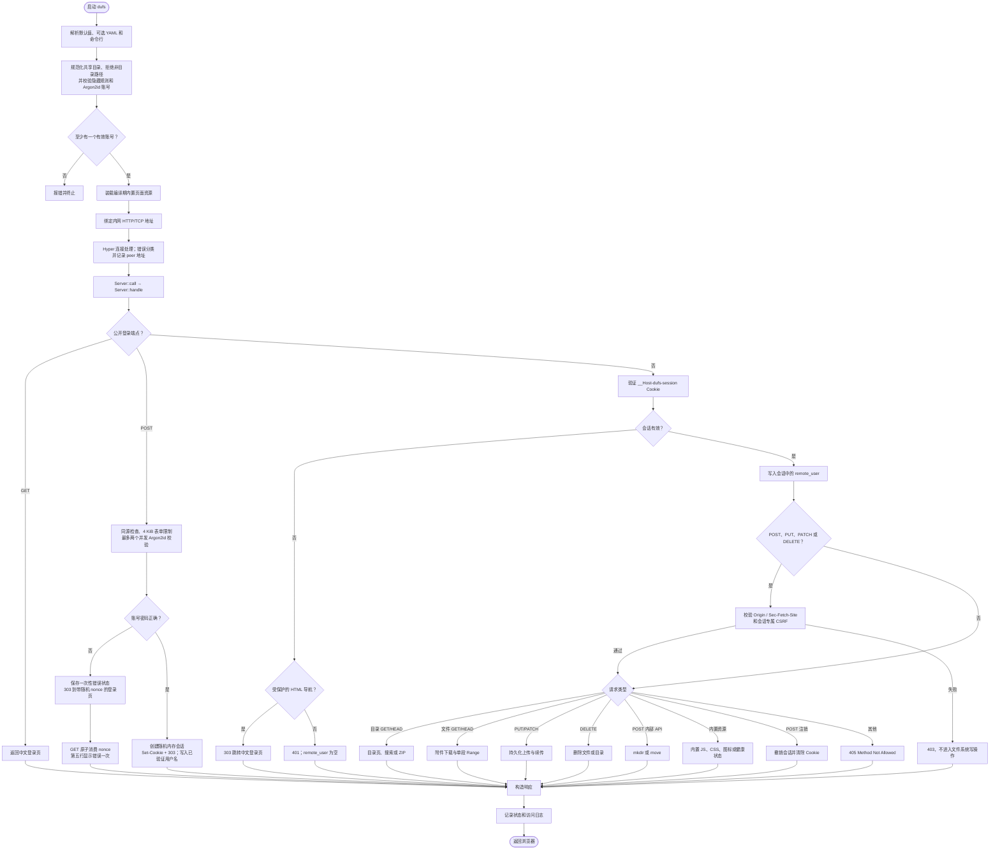

移动和重命名统一使用同源 `POST /__dufs__/api/move` JSON 接口。

## 2. 启动与监听流程

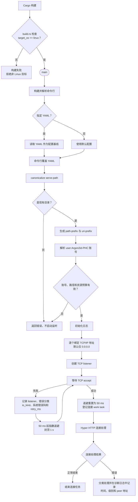

配置覆盖关系：

```text
程序默认值
└─ 可选 YAML
   └─ 命令行
```

生产配置只来自可选 YAML 和命令行，且命令行覆盖 YAML；Dufs 二进制不读取 `DUFS_*` 环境变量。`--bind` 只接受 IPv4 或 IPv6 地址，CLI 和 YAML 均会拒绝非 IP 值。YAML 反序列化启用 `deny_unknown_fields`，字段拼写错误或不属于当前配置结构的字段都会指出配置文件和未知字段并阻止启动。

TCP `accept` 返回的对端 `SocketAddr` 会作为必填参数依次传入 `handle_stream` 和 `Server::call`，访问日志始终记录 `remote_addr`。

所有监听器共享一个连接信号量，默认最多保留 256 个活跃 TCP 连接；HTTP/1 请求头读取限时 10 秒且缓冲上限为 64 KiB。普通请求处理并生成响应头默认限时 300 秒；普通文件、单段 Range 和已生成 ZIP 的响应正文传输不在该计时器内，由连接上限及外部网关的正文/空闲超时约束。上传使用独立的正文空闲时限、总时限、并发数和声明长度预算；上传与 ZIP 的磁盘水位则进入同一个按 Linux `st_dev` 分桶的空间追踪器，同一文件系统联合记账，不同文件系统互不影响。列表/搜索与 ZIP 也分别有并发、遍历项数和体积上限。预算用尽时在能够形成 HTTP 响应的层级返回 `408`、`413`、`429`、`504` 或 `507`，并在请求结束、取消或失败后由 RAII guard 释放槽位；移入阻塞 worker 的列表、搜索或 ZIP permit 会保持到 worker 真正退出，ZIP 响应 permit 还会持续到正文发送结束、失败或被客户端取消。

accept 失败不会再立即热循环：日志按资源耗尽、瞬时错误、连接错误、权限错误、listener 状态或一般 I/O 分类，并携带 listener 地址、`io_kind`、原始系统错误码和重试延迟。连续失败按 50、100、200、400、800、1000 ms 退避并封顶在 1 s；下一次成功接收后重置为 50 ms。等待连接和退避睡眠都可被停机信号打断。

连接处理错误按类型记录：无请求的探测连接关闭不记录，已进入请求后的断开使用 INFO，其余协议、超时、服务和 I/O 等异常使用 WARN；诊断信息携带时间、级别和 peer 地址，便于与网关日志对照并定位具体连接。

### 2.1 网关部署链路

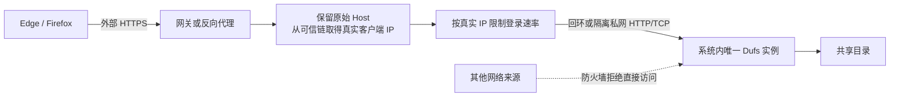

`__Host-dufs-session` 带有 `Secure`，因此浏览器必须从 HTTPS 入口访问。Dufs 严格限制同时最多执行两个 Argon2id 校验：槽位由 blocking 任务持有到计算真正结束，请求取消不会提前释放；会话只在校验结果返回到仍存活的请求后创建。该上限不是按 IP 的登录失败限速，网关仍需按可信的真实客户端 IP 限速。网关必须保留原始 `Host` 供 `Origin` 同源检查使用，并通过回环绑定、私网 ACL 或防火墙确保后端端口只允许网关访问。建议为 Dufs 使用独立主机名；固定 `Path=/` 的 `__Host-` Cookie 不能由 `path-prefix` 与同主机的其他应用隔离。

服务器初始化时打开共享根目录并试用 Linux `openat2`。旧于 Linux 5.6 的内核、禁止该系统调用的 seccomp/容器策略或其他不支持场景会明确启动失败；`RootedFs` 的最终文件打开和写变更不会为这些环境退回字符串路径实现。

## 3. 账号与认证模型

### 3.1 启动时账号解析

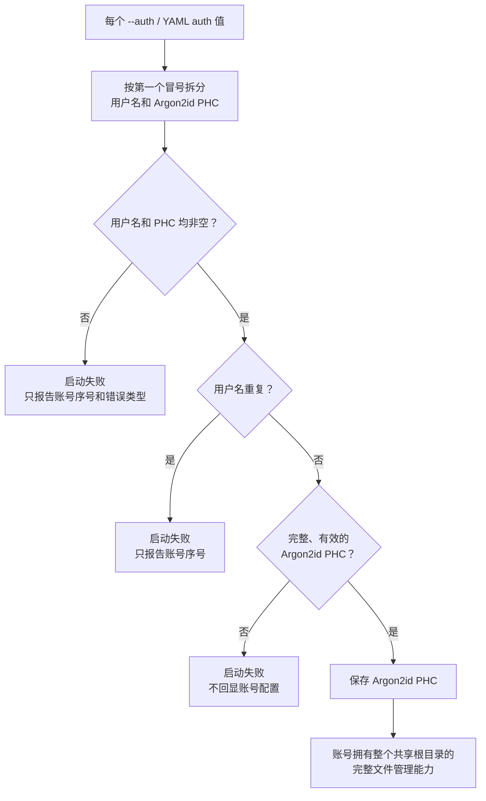

账号格式固定为 `用户名:$argon2id$...`。应先运行交互式 `dufs hash-password`，再把输出的完整 PHC 字符串写入命令行或 YAML；任何其他格式都会使启动失败。每个账号拥有整个共享根目录的完整文件管理能力，但仍不能通过符号链接访问根外对象。

### 3.2 登录与单次请求认证

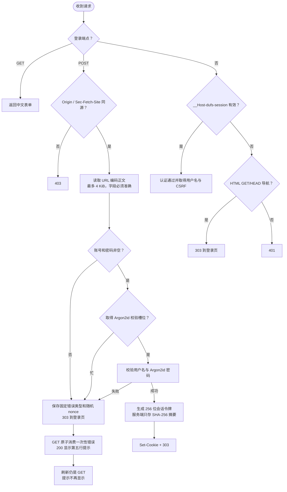

会话令牌和 CSRF 令牌都使用 256 位随机值。Cookie 中保存会话令牌原文，服务端内存只保存会话令牌摘要；会话空闲 30 分钟或创建满 12 小时后失效，最多保存 1024 个并在达到上限时淘汰最久未使用的项。状态不落盘，因此服务重启会使全部会话失效。

Cookie 固定为 `__Host-dufs-session; Path=/; HttpOnly; Secure; SameSite=Strict`，不设置 `Domain`。Argon2id 校验槽位的全局上限为两个，permit 被移入 blocking closure 并持续到校验结束；外层请求被取消时，后台计算继续持有原槽位。密码校验和会话创建已经分离，只有仍在等待校验结果的请求才会继续创建会话。网关仍需承担按可信真实客户端 IP 的登录限速。

登录失败状态不是会话 Cookie。服务端为每次失败创建独立的随机 256 位 nonce，内存中只保存固定错误类型和创建时间，60 秒后过期且总量不超过 1024 条。`303` 后的第一次 GET 原子消费状态；刷新同一 URL 时 nonce 已失效，所以不会重复 POST，也不会继续显示错误。nonce 不能用于认证或文件访问。

## 4. 中文登录、目录页与会话 CSRF

### 4.1 页面生成

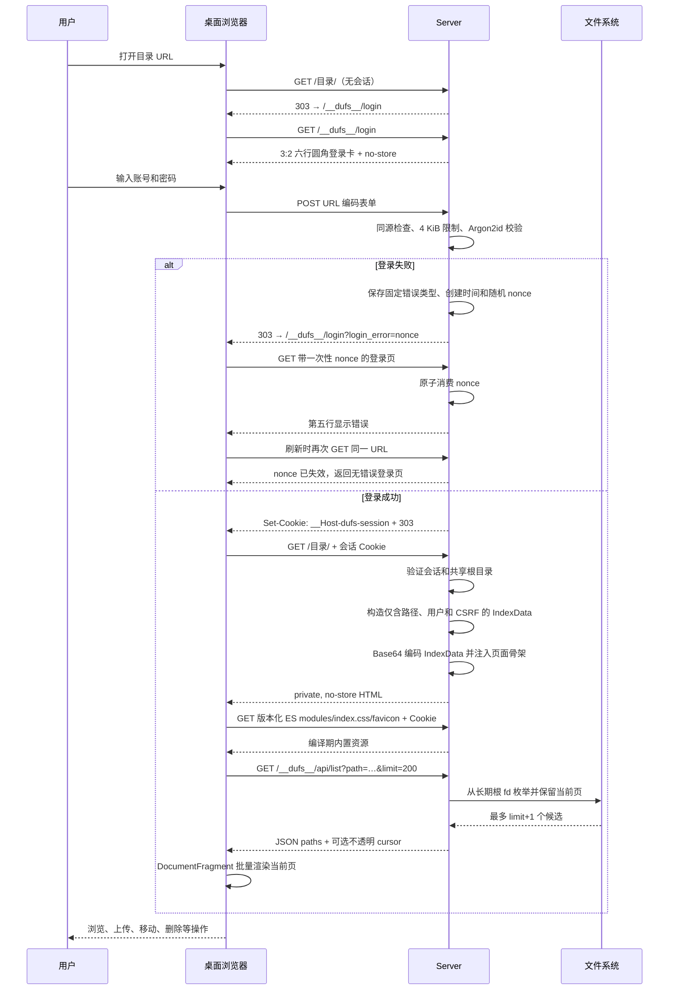

```text
IndexData
├─ href：当前目录的逻辑路径
├─ uri_prefix：部署路径前缀
├─ dir_exists：目录是否已经存在
├─ user：当前会话中的已认证账号
└─ csrf_token：当前会话专属的随机令牌
```

目录项不再嵌入 HTML。分页 API 接受 `path`、`limit`、`sort`、`order`、`q` 和不透明 `cursor`；游标同时绑定目录的设备号、inode、纳秒级 mtime/ctime、排序和查询条件。由 Dufs 引起的目录项新增、删除或替换会改变父目录快照并返回 `409`，前端不会把两个结构版本静默拼在一起。shell、virtiofs 宿主机等外部进程若只原地修改现有子文件内容、权限或时间，Linux 不保证更新父目录时间，因此不属于该游标的检测承诺。直接目录列表只保留当前页所需的 `limit + 1` 个最佳条目，不随整个目录规模创建等量 DOM。

CSRF Token 与会话一起在服务端内存中创建和保存。除使用独立来源检查的登录表单外，所有受保护的 `POST`、`PUT`、`PATCH` 和 `DELETE` 都必须同时携带有效会话 Cookie 与 `X-Dufs-CSRF-Token`；服务端以恒定时间比较当前会话的值，并结合 `Origin`、`Host` 和 `Sec-Fetch-Site` 执行同源来源校验。另一个账号或另一次登录得到的 CSRF Token 不能交叉使用。

### 4.2 内置页面资源

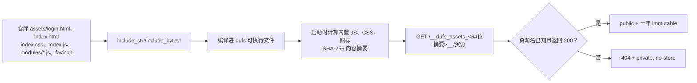

运行时外部 assets 覆盖已经删除，但仓库中的 `assets/` 仍是编译期页面源文件，不能删除。服务器不读取外部 `index.html`、`404.html` 或自定义资源目录。入口脚本使用原生 ES modules，按 API、路径、DOM、列表、文件操作和上传职责拆分，不需要生产打包器。资源前缀由全部内置模块、CSS 和图标的名称、长度与内容共同计算；其中任一项改变都会产生新的 URL。只有成功返回的已知摘要资源可以使用公共长期缓存，未知资源 `404` 返回 `private, no-store`。

## 5. 公共路由

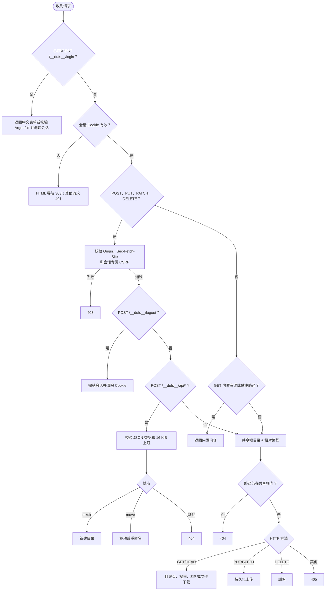

当前接口表：

| 方法 | 路径或用途 | 当前行为 |
|---|---|---|
| GET | `{uri_prefix}__dufs__/login` | 公开返回中文登录表单；有效一次性 nonce 的错误只显示一次 |
| POST | `{uri_prefix}__dufs__/login` | 同源表单登录；成功创建会话，失败保存一次性错误；两者均以 `303` 转为 GET |
| POST | `{uri_prefix}__dufs__/logout` | 要求会话、CSRF 和同源校验；撤销会话并清除 Cookie |
| GET/HEAD | 目录 | 要求会话；返回页面、搜索或直接下载 ZIP |
| GET | `{uri_prefix}__dufs__/api/list` | 要求会话；fd 根锚定的分页目录/搜索 JSON |
| GET/HEAD | 文件 | 要求会话；同一打开句柄生成附件响应和弱 ETag，支持无 `If-Range` 的单段 Range |
| GET | 版本化内置资源、健康路径 | 返回内置内容，仍需认证 |
| POST | `{uri_prefix}__dufs__/api/mkdir` | 要求会话、CSRF、同源校验；JSON 新建目录 |
| POST | `{uri_prefix}__dufs__/api/move` | 要求会话、CSRF、同源校验；JSON 移动/重命名 |
| PUT | 文件路径 | 要求会话、CSRF、同源校验以及 `X-Dufs-Upload-Id`、`X-Dufs-Upload-Length`；新建、以新 inode 覆盖或新建空文件 |
| PATCH | 文件路径 | 要求会话、CSRF、同源校验以及 `X-Dufs-Upload-Id`、`X-Dufs-Upload-Length`、`X-Dufs-Upload-Offset`；从精确检查点续传 |
| DELETE | 文件或目录 | 要求会话、CSRF、同源校验；原子移入隐藏 trash、同步后返回，后台回收空间 |

启动时只接受现有目录作为共享根。目录中的普通文件通过统一方法分派进入 `GET`/`HEAD` 附件下载，未知 HTTP 方法返回 `405 Method Not Allowed`；普通文件或其他非目录对象不能作为共享根启动服务。

## 6. 目录浏览、搜索和 ZIP

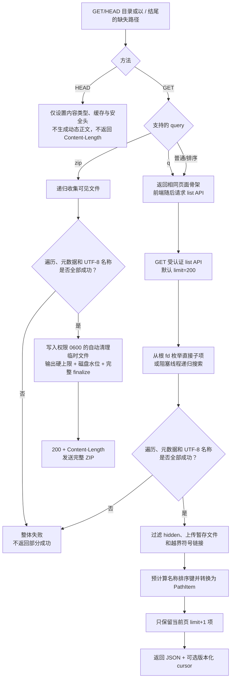

目录项不会为每个子目录再次扫描其子项。目录的 `size` 固定为 `0`，浏览器大小栏留空，避免大目录下的 N×子目录扫描。

目录查询协议是：

- `?q=关键词`：搜索；
- `?zip`：下载目录 ZIP；
- `?sort=name|mtime|size&order=asc|desc`：排序。

除此之外的查询参数不会选择其他目录输出格式。

普通目录页和搜索结果使用同一份小型 HTML 骨架，GET 不枚举目录；HEAD 在安全响应头就绪后立即返回空正文并省略 `Content-Length`。分页 API 的直接列表在阻塞线程中遍历根 fd 下的目录，只保留当前页所需的有界候选；递归搜索和 ZIP 通过有界 channel 从受跟踪的阻塞任务传递条目，并受并发、项数、体积与时间预算约束。递归遍历在解析下一项 metadata 之前扣减预算，因此一个超大单目录也不能先构造无界 `Vec`；遍历期间对象消失或由目录变为非目录时整体返回可重试的 `409`，不返回部分结果。普通文件 HEAD 根据文件 metadata 保留真实 `Content-Length`。带 upload ID 的 HEAD 是当前页面内失败任务的续传检查点查询，按第 9 章的专用语义返回持久化偏移。

目录列表、搜索和 ZIP 对遍历、目录项读取、metadata 获取及名称转换采用整体成功或整体失败语义。任一步失败都会终止本次请求并记录带路径上下文的错误，不会把已经收集的子集包装成看似完整的 `200`。浏览器 URL、页面数据和 ZIP 条目名称严格只支持 UTF-8；共享目录中存在非 UTF-8 名称时，相应目录、搜索或 ZIP 请求会整体失败，部署者必须先在 Linux 侧将该名称重命名为有效 UTF-8。

## 7. 文件下载

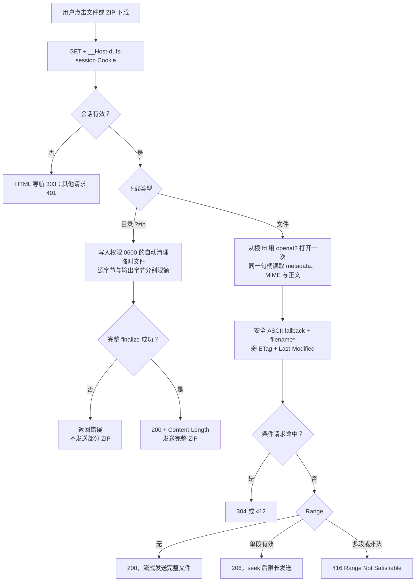

文件、目录 ZIP 和单段 Range 都直接使用会话 Cookie。普通文件 GET 始终返回附件下载响应，查询参数不会切换为其他文件模式；浏览器端不提供预览、编辑或保存入口。

文件从共享根目录文件描述符经 `openat2` 打开一次；metadata、可选内容样本和正文均来自该句柄。常见已知二进制扩展名直接采用扩展名 MIME，不读取样本；扩展名未知或文本类型才读取最多 1024 字节进行文本/字符集判断，并在随后 seek 回起点。因此并发原子替换只影响后续新请求，当前响应的正文、`Content-Length`、MIME 和验证器保持同一 inode 版本。

ETag 使用设备号、inode、长度及纳秒级 mtime/ctime 生成，并明确带 `W/`，它用于区分通常的文件版本但不是内容摘要。条件请求按 HTTP 优先级执行：`If-Match` 优先于 `If-Unmodified-Since`，`If-None-Match` 优先于 `If-Modified-Since`。相同 `If-None-Match` 可按弱比较得到 `304`；`If-Match` 要求强比较，回放服务端发出的弱 ETag 会得到 `412`，而存在文件上的 `If-Match: *` 仍可通过。

弱 ETag 不能满足 `If-Range` 的强比较，秒级 `Last-Modified` 也不能安全区分快速原子替换，所以只要请求携带 `If-Range`，服务端就忽略 Range 并发送完整 `200`。没有 `If-Range` 时，合法单段 Range 返回 `206`，多段或非法 Range 返回 `416`。

服务端在最终响应出口对所有登录和认证响应强制设置 `Cache-Control: private, no-store`，覆盖完整文件、HEAD、`206`、`304`、`412`、`416`、ZIP、上传、API 和错误响应，也不依赖 ETag 或 Last-Modified 是否成功生成。只有成功返回的版本化内置脚本、样式和图标进入明确的公共缓存白名单；未知资源和错误响应不可长期缓存。`no-store` 有意放弃认证文件的浏览器缓存和自动条件复用，以换取最严格的缓存边界。网关须关闭认证路径缓存并保留上游 `Cache-Control`。

下载名使用固定安全 ASCII `filename` 作为通用回退，真实 Linux 文件名通过符合 RFC 6266/8187 形式的 UTF-8 `filename*` 参数传递。普通文件和目录 ZIP 使用同一构造函数，因此双引号、反斜线、分号、空格、中文、emoji 和控制字符不会进入可产生歧义的传统 quoted-string；现代 Edge 和 Firefox 从 `filename*` 取得真实名称。

目录 ZIP 不会一边压缩一边向客户端发送。服务端先在权限为 `0600`、无论成功或失败都会自动清理的临时文件中生成归档；只有全部遍历、文件读取和 ZIP `finalize` 成功后，才返回 `200`、准确的 `Content-Length` 和完整归档。源文件上限按复制时实际读取的字节累计，即使文件在收集 metadata 后继续增长也不能绕过；临时归档按实际写入字节执行独立硬上限。每次归档写入前，服务在共享磁盘追踪器的同一锁内取得临时文件的 `st_dev` 和 `fstatvfs`，并按“最低保留空间 + 同文件系统上传剩余量及其他 ZIP 待完成写入预留 + 本次缓冲”检查；处于异步 `Pending` 的写入会一直持有其增量预留，写入完成、失败或丢弃后释放，已经写入临时文件的字节由文件系统可用空间自然反映。输出超限返回 `413`，磁盘水位不足返回 `507`。生成阶段的任何错误都发生在响应正文交付前，因此客户端不会收到状态为成功但内容截断的 ZIP；生成成功后，ZIP 并发 permit 仍由响应正文持有，直至发送完成、错误或客户端取消。联合追踪器封闭的是 Dufs 进程内部竞态；外部进程、virtiofs 宿主机或存储侧空间变化仍可能在检查后竞争磁盘，因此必须配置有余量的水位并监控底层文件系统。

## 8. 统一写请求防护与同源 JSON API

### 8.1 全部写方法的公共检查

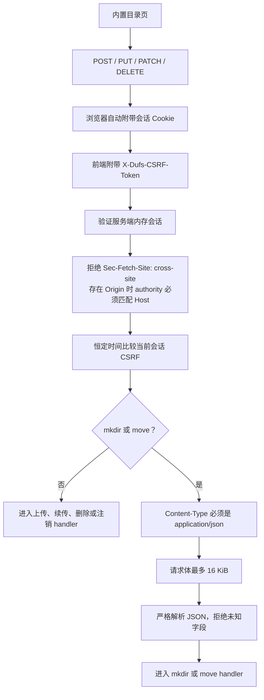

会话验证、来源检查和 CSRF 比较位于具体写操作之前。缺失、伪造或来自另一个会话的 CSRF Token 返回 `403`，不会创建、追加、移动或删除磁盘对象。登录 POST 尚未建立会话，因此使用独立的同源来源检查、严格表单字段和 4 KiB 正文上限。

### 8.2 新建目录

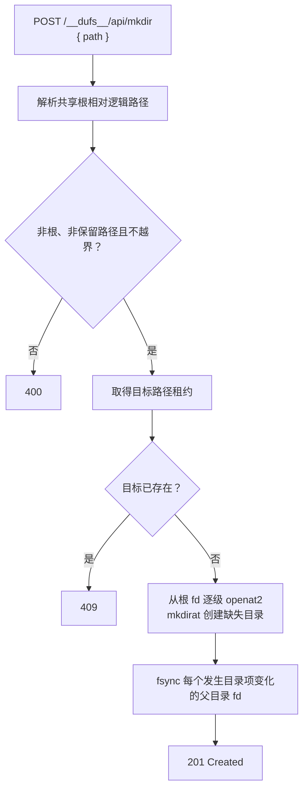

### 8.3 移动和重命名

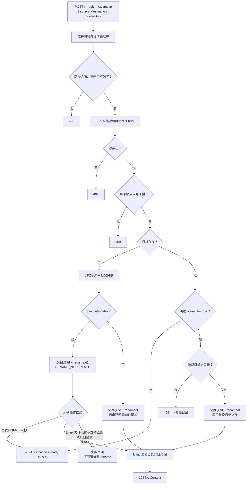

浏览器第一次收到“目标已存在”的 `409` 后才询问用户是否覆盖；用户确认后重新发送 `overwrite: true`。

`overwrite: false` 的最终移动通过 rustix 调用 Linux `renameat2(RENAME_NOREPLACE)`。前置 metadata 检查只用于尽早返回已知冲突和检查类型，不再承担“不覆盖”保证；即使目标随后出现，最终原子调用也会保留目标并返回 `409`。Linux 文件系统不支持该原语时会返回错误并失败关闭，不会降级为普通 rename。`overwrite: true` 使用父目录 fd 上的 Linux `renameat` 原子替换目标。

源和目标先作为一个租约集合交给路径协调器，规范化、排序并一次取得；反向移动不会因加锁顺序不同死锁。最终父目录从长期持有的共享根 fd 通过 `openat2` 打开，rename 只接收父目录 fd 和最后一个文件名，不再按绝对字符串路径重新解析。成功 rename 后同步源和目标父目录 fd，全部成功才返回 `204`；同一父目录内移动可能同步同一个 fd 两次，但不会提前返回。

### 8.4 统一路径协调与 fd-relative 最终变更

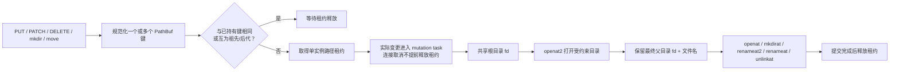

路径协调器覆盖同一路径以及祖先/后代关系，所以删除或移动目录会等待其子树中的上传，上传也不会在祖先删除提交期间穿过。互不为祖先的不同子树可以并行；这让来自个人多台设备的无冲突上传不必经过全局写锁。单个浏览器页面仍只有一个上传槽位，但服务端并发边界不受该前端限制。

整个上传处理及 mkdir、move、DELETE 的实际文件系统变更由独立 mutation task 持有路径租约。外层 Hyper 响应 future 因浏览器断线或网关取消而结束时，已经登记的内层任务仍会完成错误处理或提交，再释放租约；底层 `spawn_blocking` 文件操作不会在失去租约后继续与下一台设备交错。另有一个仅覆盖祖先创建、最终目录发布和父目录 `fsync` 的短临界区，保证两个兄弟路径并发创建共同父目录时，每个成功请求都建立在该祖先已经持久化的基础上，而不把全部文件正文写入全局串行化。

`RootedFs` 固定使用 `RESOLVE_BENEATH | RESOLVE_NO_MAGICLINKS`，因此通过它完成的最终文件打开和写变更不能越过启动时持有的共享根 fd；解析后仍在根内的相对符号链接可以使用，绝对链接和根外目标会被这些调用拒绝。悬空或成环的根内相对链接只以 nofollow metadata 列出，可由 DELETE 删除或 PUT 原子替换；普通 GET 仍返回 `404`。`openat2` 是强制 Linux 运行要求，不支持时服务启动失败。

路径租约只协调当前 Dufs 进程中经过这些 handler 的写请求；shell、其他本地进程和 virtiofs 宿主机进程仍可改变对象。为避免字符串路径在外部替换后切换到另一个根，路由 metadata、目录枚举、搜索、ZIP 和维护扫描全部从启动时长期持有的根 fd 出发，逐级使用 `openat2`/`*at`；运行中把启动路径重命名并放入替换目录时，服务仍只读取和清理原根。路径协调器同时比较词法祖先关系和目录设备号/inode 组成的语义键，因此同一根内相对符号链接别名与真实路径不会绕过写租约。租约插入和释放都会推进协调版本；等待者在版本变化后重新解析语义键，并在插入前原子核对版本，别名重定向期间不会使用旧目标身份。外部竞争导致某一级对象身份变化时请求安全失败或观察一个已打开对象，不会转而信任新字符串路径。

## 9. 持久化上传与断点续传

### 9.1 浏览器侧

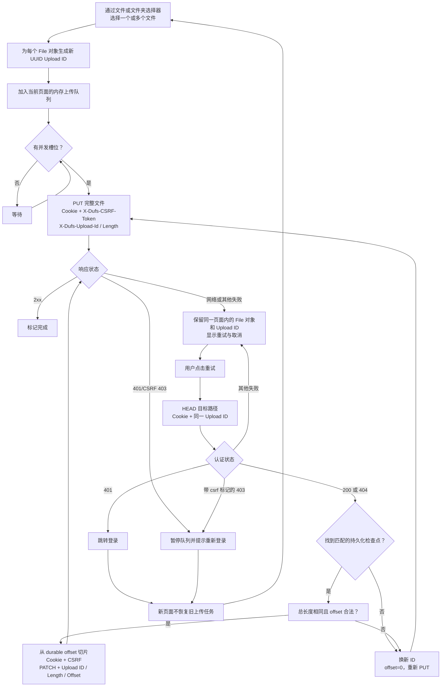

浏览器不再把上传 ID 或续传身份写入 `localStorage`。文件名、相对路径、大小和 `lastModified` 不能证明两个文件内容相同；跨刷新按这些属性复用旧 ID 可能把不同内容拼接成一个最终文件。当前实现只允许同一页面、同一个仍在内存中的 `File` 对象重试，因此可以安全复用该任务的 ID；HEAD 只信任服务端已经持久化的 offset 和首次绑定的总长度。

刷新、重新登录或关闭页面会失去旧任务关联；重新选择文件始终生成新 ID 并完整 PUT。服务端遗留检查点保持隐藏，达到 TTL 后由维护任务清理。CSRF 或同源来源校验失败使用带机器标记的 `403` 并暂停当前队列；重新登录后用户重新选择文件会建立新任务。拖放不是上传入口，页面只阻止携带文件的 `dragover`/`drop` 触发浏览器默认导航；上传仅由文件和文件夹选择器触发。

### 9.2 服务端暂存与检查点

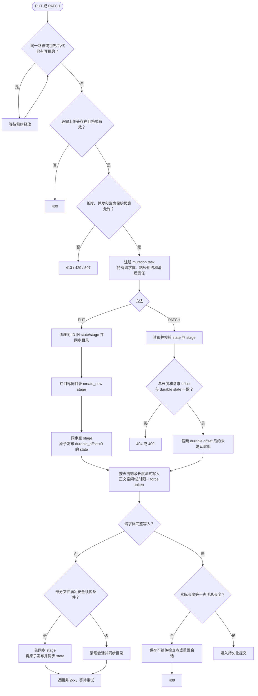

`PUT` 必须携带 UUID 格式的 `X-Dufs-Upload-Id` 和十进制 `X-Dufs-Upload-Length`；`PATCH` 还必须携带十进制 `X-Dufs-Upload-Offset`。缺少或无法解析必需请求头时返回 `400`；upload ID 对应的状态不存在时返回 `404`；总长度或 PATCH offset 与持久化状态不一致时返回 `409`。声明长度超过上限返回 `413`，上传槽位已满返回 `429`，保留空间水位无法满足返回 `507`。上传开始前按暂存文件所在 `st_dev` 预留全部声明剩余量，每次写入前又在同一锁内以 `fstatvfs` 核对最低水位和该文件系统当前全部预留；成功写入后才等量释放未来预留，因此同盘 ZIP 和其他上传不能利用检查与异步写入之间的空窗突破水位。接收器最多写入声明的剩余字节，并继续确认正文确实结束；多出的任意字节返回 `413` 且不发布目标。只有检查全部通过后才会写暂存文件。

上传暂存文件使用严格的内部名称结构，目录列表、搜索、ZIP 和普通 URL 解析会排除符合该结构的内部项。临时文件通过父目录 fd 上的 `openat(O_CREAT|O_EXCL|O_NOFOLLOW)` 原子创建，避免覆盖完全相同名称的对象。仅有 `.dufs-upload-` 前缀但不符合当前严格结构的名称按普通用户文件处理，不会被隐藏或维护任务删除。

stage/state 及状态临时文件按最后修改时间采用 7 天 TTL。后台维护在服务启动时立即扫描一次，此后每小时扫描。活跃上传以“父目录设备号/inode + 内部文件名”语义键登记，因此经根内符号链接别名发起的上传与维护从真实目录发现的文件仍是同一个键。对每个达到 TTL 的 stage/state，扫描器会在实际删除前重新取得活跃集合锁，并在持锁期间完成“复核是否活跃 → 删除”；已经登记的活跃项因此会被严格跳过，不依赖扫描开始时的集合快照。stage/state 只按普通文件清理；异常的非 trash 保留前缀目录只记录告警并跳过，不在持有上传登记锁时递归删除。每个内部文件成功清理后都会 `fsync` 所在父目录并记录日志。隐藏删除暂存项正常由请求后的后台任务立即清理；若异常退出遗留，启动扫描使用零等待立即清理，运行期间失败项则在每小时维护中按 1 小时阈值重试。7 天和 1 小时都是进入清理的阈值而非空间占用上限，扫描、删除或父目录同步失败会继续延后。

### 9.3 持久化提交

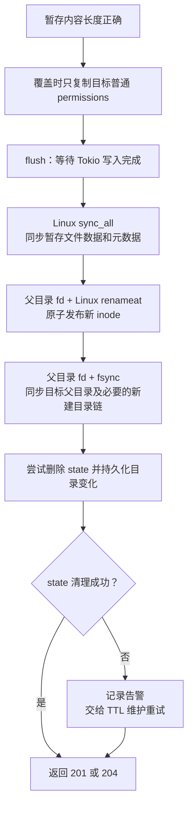

图中的覆盖语义已经明确为“发布新 inode，只复制普通 permissions”。它不复制旧 inode 的 owner/group、POSIX ACL、扩展属性或硬链接身份；新 inode 由 Dufs 运行用户创建，指向旧 inode 的其他硬链接继续看到旧内容。该选择换取读者始终看到完整旧版本或完整新版本，使用 ACL、扩展属性或依赖硬链接同步更新的目录不应在没有额外迁移措施时采用此覆盖方式。

原子性和持久性是两个不同目标：

- 同目录临时文件加 rename 让读者只看到旧文件或完整新文件；
- `flush` 只保证 Tokio 的待处理写入完成，不等于物理落盘；
- Linux `sync_all` 要求操作系统把暂存文件数据和元数据同步到存储；
- Linux 同文件系统 `rename` 原子发布最终文件；
- rename 后对父目录执行 `fsync`，使新的目录项在崩溃恢复后可找回。

成功响应表示暂存文件同步、最终 rename 和目标父目录 `fsync` 已经成功返回，而不是无条件的绝对物理保证。最终提交后的内部 state 清理失败不会改变新文件已经落盘的事实，只记录告警并由后续维护重试。Linux 文件系统、网络存储、磁盘控制器和固件仍必须正确兑现同步命令；介质损坏、固件错误报告、后续位腐败等问题仍需依靠可靠存储、校验和与备份处理。

这一提交序列通过 `StorageDurability` 边界注入：生产实现执行文件 `sync_all`、根 fd 内 rename 和父目录同步；单元测试可分别注入“文件同步失败”和“rename/父目录同步失败”，验证失败不会越过后续阶段。下载端从根 fd 打开一次文件，并从同一句柄取得 metadata、可选 MIME 样本和正文；覆盖期间已经打开的响应继续读取旧 inode，新请求读取新 inode，不再混合 `Content-Length`、ETag、MIME 和正文。metadata 预检后若路径恰好被另一写请求删除或移动，打开阶段的 `ENOENT`/`ENOTDIR` 返回 `404` 而不是 `500`。

mutation task 从上传开始处理起就持有请求体、上传路径锁、活跃 stage/state 租约和暂存文件清理责任。外层 HTTP 等待 future 被浏览器断开或网关取消时，内层任务继续处理正文结束/I/O 错误并完成检查点或清理，底层阻塞文件操作不会脱离路径租约运行。停机的 30 秒普通任务宽限期结束时，force token 会中断正文接收，但服务仍等待 mutation task 完成安全收尾；最终 rename 与目录 `fsync` 不会被普通取消拆开。第二次停止信号或 SIGKILL 会绕过等待，因此属于不能保证落盘的破坏性边界。

## 10. 新建空文件与删除

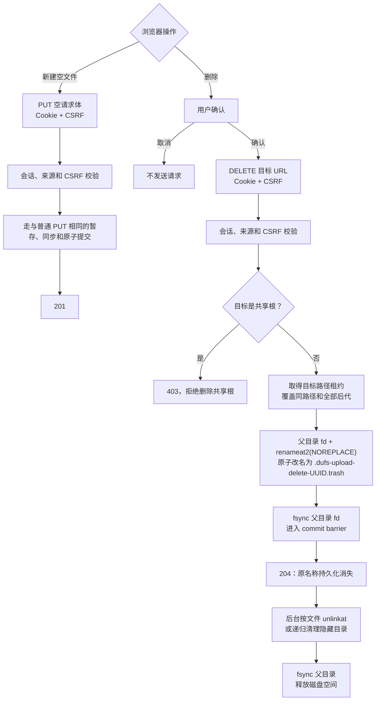

删除路由在文件类型判断前使用与内部浏览器 API 共用的根目录守卫；即使认证和 CSRF 均有效，只要目标等于规范化的 `serve_path` 就返回 `403`。默认根、`path-prefix`、编码等价路径和越界符号链接均有回归测试。

普通子对象删除先在同一父目录内原子移动到 `.dufs-upload-delete-<UUID>.trash`，并在 commit task 中同步父目录；只有这些步骤成功才返回 `204`。因此文件或整个目录树会一次从原业务名称下消失，断电恢复后不会因未同步目录项而重新出现。目标路径租约覆盖其后代，子树上传、move、mkdir 或另一个 delete 必须等待可见删除提交完成。

返回 `204` 后的递归清理只负责释放隐藏暂存项占用的空间，不改变已经提交的可见删除结果。后台清理失败、普通停机超时取消或进程崩溃可能暂时留下内部项；启动维护会立即清理所有遗留 delete trash，运行期间每小时扫描会回收达到 1 小时阈值的失败项。该内部机制不提供列出、恢复或撤销接口，不是用户回收站；大目录 DELETE 的 `204` 也不表示全部块已经释放。维护扫描会在目录项之间检查停止信号，但单个巨大 trash 一旦进入同步 `remove_dir_all` 就不能在目录树中途取消，这既是空间回收延迟边界，也是普通停机可能超过宽限期的边界。

## 11. 浏览器操作树

```text
现代桌面浏览器加载目录页
├─ 无有效会话：303 到中文登录页
│  └─ POST 账号密码表单 → Argon2id 校验 → Set-Cookie + 303
├─ 携带 __Host-dufs-session Cookie
├─ 解码仅含页面上下文与当前会话 CSRF 的 IndexData
├─ 分页 list API → 每页最多 500 项 → DocumentFragment 批量渲染
├─ 使用编译期内置 ES modules/CSS/图标
├─ 显示当前账号与 POST 退出入口
└─ 用户操作
   ├─ 进入目录：GET /目录/
   ├─ 搜索：GET ?q=关键词
   ├─ 下载文件：Cookie 直接 GET，可选单段 Range
   ├─ 下载目录：Cookie 直接 GET ?zip
   ├─ 上传：文件/文件夹选择器 → 当前页内存队列 → Cookie + CSRF + PUT + Upload ID/Length
   │  ├─ 当前页失败重试：Cookie + HEAD 查询持久化 offset → Cookie + CSRF + PATCH + Upload ID/Length/Offset
   │  ├─ 带 csrf 标记的 403：暂停整个队列并禁止继续发请求
   │  └─ 页面刷新或重新登录：不恢复旧 ID；重新选择会创建全新 PUT
   ├─ 新建空文件：Cookie + CSRF + 空 PUT + Upload ID/Length=0
   ├─ 新建目录：Cookie + CSRF + 同源 JSON POST /__dufs__/api/mkdir
   ├─ 移动/重命名：Cookie + CSRF + 同源 JSON POST /__dufs__/api/move
   ├─ 删除：Cookie + CSRF + DELETE → 原子隐藏并 fsync 后 204 → 后台释放空间
   └─ 退出：Cookie + CSRF + POST /__dufs__/logout，服务端撤销会话
```

## 12. 响应、日志与停止

### 12.1 响应和日志

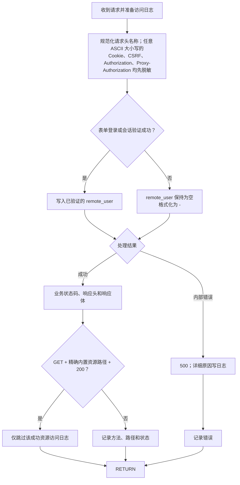

页面资源与文件接口只按同源方式工作，不生成 `Access-Control-Allow-*` 响应头。只有表单密码校验成功或会话验证成功的请求才把已验证用户名写入 `remote_user`，认证失败或未认证请求在日志中显示 `-`。自定义 `$http_...` 变量中位于固定 `$http_` 前缀后的请求头名称会先统一为 ASCII 小写，再把下划线转换为连字符；因此 Authorization、Proxy-Authorization、Cookie 和 CSRF 的名称部分使用全小写、全大写或混合大小写时都会输出 `[REDACTED]`，普通请求头仍按 HTTP 的大小写不敏感语义记录。

访问日志只跳过同时满足三个条件的请求：方法是 `GET`、规范化后的路径精确匹配已知内置 JavaScript/CSS/图标、响应状态是 `200`。内置资源的 `HEAD`、未知资源、资源错误，以及页面、健康检查、登录、下载和 API 请求仍照常记录；处理器返回的内部错误也始终记录。连接级错误与 HTTP 访问日志分开处理，诊断记录会按错误类型分类并带上时间、级别和 TCP peer 地址。

HTTP 访问日志从动态字段拼接阶段就使用 16 KiB 有界构造器，重复变量不会先形成巨型临时字符串；请求线程只把已经转义为单个物理行、再次经过 16 KiB 入队硬上限的日志放入容量 4096 的有界 channel，不直接写终端或文件。超长 UTF-8 文本会在字符边界截断并只带一个固定标记；自定义日志格式最多 4096 字节和 128 个解析元素，超限配置会阻止启动。独立写线程批量写入并每 250 ms 刷新；队列满时丢弃最新记录，运行中至多每秒输出一次聚合 `dropped_newest` 告警，显式 flush 和退出仍提交累计数。正常停止最多等待 5 秒提交 flush 命令，避免慢日志目标无限阻塞退出。请求 URI、请求头、用户名、连接错误和 handler 错误都经过控制字符转义，认证、Cookie 与 CSRF 头继续脱敏。

### 12.2 分阶段优雅停止流程

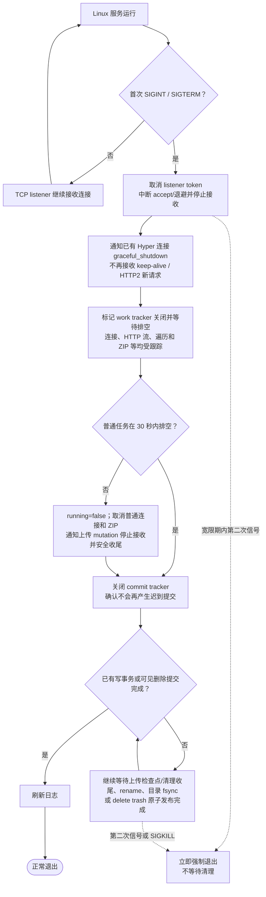

Linux 上首次收到 SIGINT 或 SIGTERM 时只开始排空，不立即把 `running` 设为 false，因此搜索、下载、ZIP 和上传有机会自然结束。连接、Hyper 执行器生成的内部流、后台 ZIP、内部文件维护和 delete trash 递归清理由 work tracker 跟踪；上传从开始处理起就在 commit tracker 中由独立 mutation task 持有请求体和租约。30 秒到期后取消普通连接和 ZIP，同时以 force token 让仍在接收正文的上传停止接收、保存有效检查点或清理暂存；服务等待该收尾，以及 mkdir、move、最终 rename/目录 `fsync` 和可见删除提交完成。

维护任务收到首次停止信号后，会在根 fd 相对遍历的目录项之间检查取消状态并停止发现新候选。过期 stage/state 在删除前还会实时取得活跃集合锁，并在持锁期间复核和删除，保证已经登记的活跃项严格跳过；异常的非 trash 内部目录只告警并跳过。如果扫描已对单个巨大 delete trash 进入同步 `remove_dir_all`，该调用没有目录树中途取消点；work tracker 会等待扫描返回，再等待本轮已删除内部项的父目录全部 `fsync` 完成。请求返回后启动的普通 trash 回收仍可能在超时后被取消，但原名称已经持久化删除，遗留 trash 会在下次启动立即清理。

30 秒是普通任务的宽限期，不是硬退出时限。最终提交、底层文件系统同步或上述巨大 trash 清理较慢时，正常停止都可能超过 30 秒。宽限期间收到第二次 SIGINT/SIGTERM 会由程序立即退出，SIGKILL 则根本无法被程序捕获，两者都可能中断正在进行的最终提交或维护落盘。

通过 systemd 运行时，`TimeoutStopSec` 必须大于 30 秒，并应为实际存储设备的最慢最终同步留出额外余量。否则 systemd 超时后发送的 SIGKILL 会越过 commit barrier；例如可以从 `TimeoutStopSec=45s` 起步，再按慢盘或网络存储的实测结果调大，而不能把 45 秒视为普适保证。

## 13. 代码阅读与测试顺序

`src/server.rs` 是服务端模块入口，子模块按浏览器文件管理职责组织。结构拆分不改变本章前述 HTTP 路径、方法和状态码流程。

```mermaid
flowchart TD
    T["0. build.rs / rust-toolchain.toml / Cargo.toml<br/>64 位 Linux、Rust 1.97.1、2024 edition 和编译基线"] --> A["1. main.rs<br/>HTTP/TCP、连接预算和 Linux 信号停止"]
    A --> B["2. args.rs<br/>账号、IP 地址和运行配置"]
    B --> C["3. auth.rs<br/>Argon2id 账号、会话摘要和 CSRF"]
    C --> D["4. server.rs<br/>服务入口、公共路由和路径边界"]
    D --> DS["4.1 server/disk_space.rs<br/>按 st_dev 联合计算上传与 ZIP 空间"]
    DS --> E["5. server/path_coordinator.rs<br/>同路径与祖先/后代写租约"]
    E --> F["6. server/rooted_fs.rs<br/>根 fd、openat2、父 fd 与 *at 操作"]
    F --> G["7. server/session.rs<br/>登录、注销、Cookie 和写请求防护"]
    G --> H["8. server/browser_api.rs<br/>mkdir、move JSON API"]
    H --> I["9. server/listing.rs<br/>目录页、搜索和 ZIP"]
    I --> J["10. server/download.rs<br/>单句柄附件、弱 ETag 和单段 Range"]
    J --> K["11. server/upload.rs<br/>上传会话、TTL 维护与删除暂存清理"]
    K --> L["12. server/storage.rs<br/>可注入的 sync/rename/父目录同步边界"]
    L --> M["13. assets/login.html / modules/*.js<br/>登录卡、分页、写操作和当前页上传队列"]
    M --> N["14. Rust 集成测试<br/>根替换、分页、故障注入、上传和删除"]
    N --> O["15. Playwright<br/>HTTPS 网关下 Chromium + Firefox 流程"]
```

```mermaid
flowchart TD
    TEST["验证入口"] --> TOOLCHAIN["rustc --version / cargo --version<br/>确认固定的 1.97.1 工具链"]
    TOOLCHAIN --> RUST["cargo clippy --all-targets --all-features<br/>cargo test --all-features"]
    TEST --> FRONT["npm run test:frontend"]
    RUST --> ROUTES["Argon2id、会话、CSRF、路由、分页、单段 Range、持久化上传"]
    ROUTES --> MAINTENANCE["upload.rs 维护竞争回归测试<br/>删除前实时持锁复核 active stage/state"]
    FRONT --> BUILD["构建 dufs；每个项目启动动态 HTTP 后端<br/>和 Node HTTPS 测试网关"]
    BUILD --> CHROMIUM["无头桌面 Chromium<br/>仅作为 Edge 内核兼容基线"]
    BUILD --> FIREFOX["无头桌面 Firefox"]
    CHROMIUM --> FLOWS["3:2 六行登录卡、Cookie、注销、下载和写操作"]
    FIREFOX --> FLOWS
    FLOWS --> RANGE["分页浏览、文件直连、单段 Range、ZIP 和写操作"]
    RANGE --> FAULT["同一页面内注入部分上传与断线<br/>验证 HEAD offset → PATCH"]
    FAULT --> IDENTITY["注入旧 localStorage 同元数据记录<br/>确认被忽略并使用新 ID 完整 PUT"]
    IDENTITY --> OTHER["同时检查队列重试/取消、认证暂停、拖放上传禁用、文件夹选择器、CSRF、DOM 安全和中文可访问名称"]
```

`build.rs` 在 Cargo 构建脚本阶段同时检查目标操作系统和指针宽度；只有 64 位 Linux 进入应用编译。`rust-toolchain.toml` 让 rustup 在仓库目录中自动选择 Rust/rustc/Cargo 1.97.1，并提供 Clippy 与 Rustfmt；`Cargo.toml` 用 `edition = "2024"` 和 `rust-version = "1.97.1"` 声明源码 edition 与最低 Rust 版本。项目已删除内置 TLS feature，唯一 Rust 构建与网关后的 HTTP 后端部署一致。

Playwright 为隔离浏览器测试而使用的端口、证书和密钥环境变量只由 Node 测试进程读取；Node 在外部测试端口提供 HTTPS 并把请求代理到 Dufs 动态回环 HTTP 端口。仓库中的固定测试私钥是公开的 localhost 测试材料，绝不能部署为生产网关密钥。Dufs 二进制仍只通过显式命令行参数启动，因此这些变量不属于生产配置入口。

`src/server/upload.rs` 的 `maintenance_rechecks_the_live_lease_set_before_deleting` 专门制造维护扫描等待活跃集合锁、上传在其获得锁前登记 stage 的时序；测试要求扫描器随后看到实时集合并保留该 stage。它与 `maintenance_removes_expired_sessions_and_trash_but_skips_active_files` 一起验证当前实现没有在扫描开始时复制一份可能过期的 active 快照。

阅读代码时重点确认：

1. 页面动作发送的是普通文件方法还是 JSON POST 内部 API；
2. 受保护请求是否先通过会话验证，以及所有受保护的 `POST`、`PUT`、`PATCH`、`DELETE` 是否统一校验会话专属 CSRF 和来源；
3. 逻辑路径如何限制在共享根目录内；
4. 上传的 stage、state、持久化 offset 和最终目标分别在何时变化；
5. 成功状态码是在文件和目录同步之前还是之后返回；
6. 对应行为是否有 Rust 集成测试和桌面浏览器测试覆盖。
